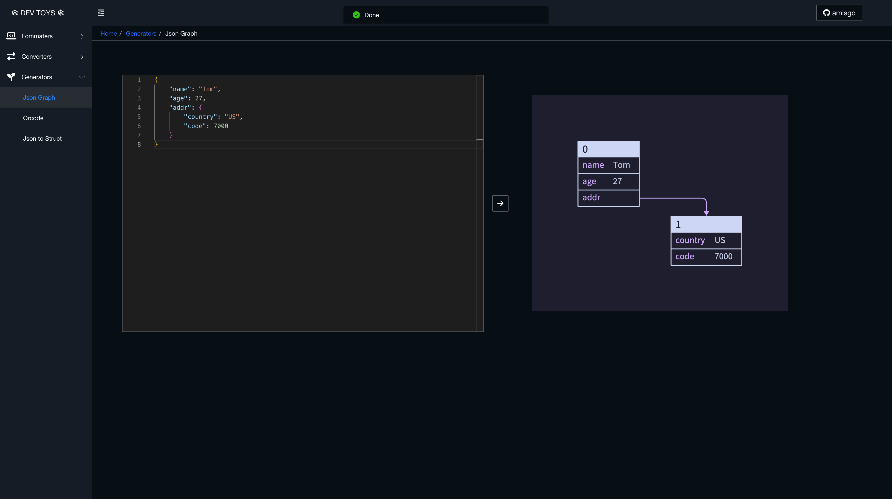

# amisgo-examples

Examples for [amisgo](https://github.com/zrcoder/amisgo)

- [hello](hello)
- [api](api)
- [config](config)
- [convert](convert)
- [submit](submit)
- [embeded table](embed-table)
- [multiple page app](multiple-page)
- [all](all)
- [Dev Toys](dev-toys)
  

## Usage

```sh
go mod tidy

go run ./dev-toys
```

Then visit http://localhost
